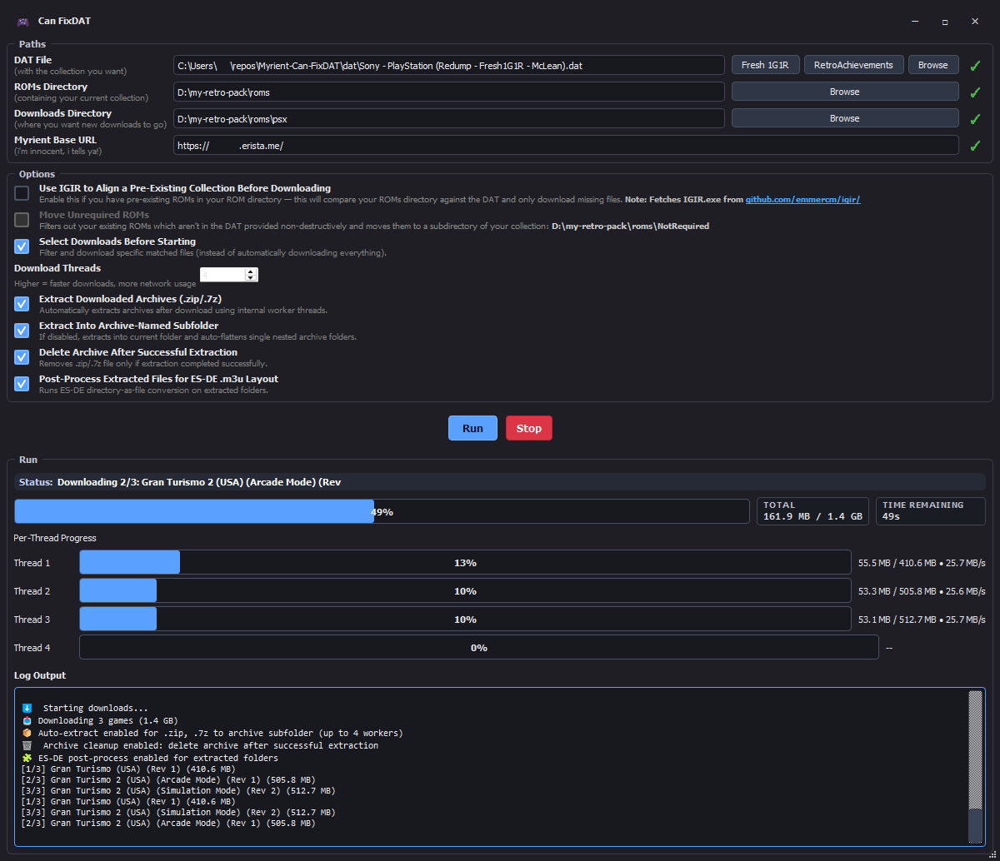
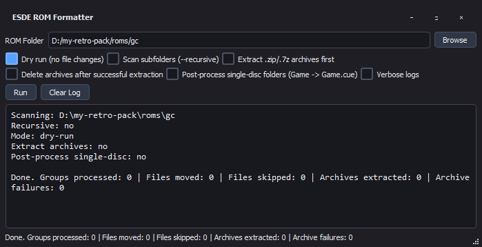

# 🎮 Can FixDAT

> Two desktop apps in one repo:
> - **CanFixDAT** (`CanFixDAT.py`) — DAT/fixdat-based downloading from Myrient  
> - **ESDE ROM Formatter** (`esde_rom_formatter_gui.py`) — ES-DE directory-as-file + M3U formatter



---

## 🚀 Quick Start

### Standalone
1. Open [Releases](https://github.com/freestyleabg/Myrient-Can-FixDAT/releases)
2. Download the asset for the app you want
3. Run it

### Run from source

```bash
git clone https://github.com/freestyleabg/Myrient-Can-FixDAT.git
cd Myrient-Can-FixDAT
pip install PyQt5 requests lxml
```

Run CanFixDAT:

```bash
python CanFixDAT.py
```

Run ESDE ROM Formatter:

```bash
python esde_rom_formatter_gui.py
```

---

## 🏷️ Releases

| App | Tag format | Example |
|---|---|---|
| CanFixDAT | `fixdat-vX.Y.Z` | `fixdat-v1.1.1` |
| ESDE ROM Formatter | `formatter-vX.Y` or `formatter-vX.Y.Z` | `formatter-v0.1.1` |

**Assets:**
- CanFixDAT: `CanFixDAT.exe`, `CanFixDAT-macos.zip`
- Formatter: `ESDE-ROM-Formatter.exe`, `ESDE-ROM-Formatter-macos.zip`

---

## 🎯 CanFixDAT

### Inputs
- `DAT file`
- `ROMs directory`
- `Downloads directory`
- `Myrient base URL`

### Built-in DAT sources
- Fresh 1G1R ([Fresh1G1R](https://github.com/UnluckyForSome/Fresh1G1R))
- RetroAchievements DATs ([Unofficial RA DATs](https://github.com/UltraGodAzgorath/Unofficial-RA-DATs))

### Options
- `Use IGIR to Align a Pre-Existing Collection Before Downloading`
- `Move Unrequired ROMs`
- `Select Downloads Before Starting`
- `Download Threads`
- `Extract Downloaded Archives (.zip/.7z)`
- `Extract Into Archive-Named Subfolder`
- `Delete Archive After Successful Extraction`
- `Post-Process Extracted Files for ES-DE .m3u Layout`

---

## 🧩 ESDE ROM Formatter



### Files
- `esde_rom_formatter_gui.py` (GUI)
- `esde_rom_formatter_core.py` (CLI/core)

### Reference
- ES-DE docs: https://gitlab.com/es-de/emulationstation-de/-/blob/master/USERGUIDE.md#directories-interpreted-as-files

### GUI options
- `Dry run (no file changes)`
- `Scan subfolders (--recursive)`
- `Extract .zip/.7z archives first`
- `Delete archives after successful extraction`
- `Post-process single-disc folders (Game -> Game.cue)`
- `Verbose logs`

### Folder layout example (multi-disc)

Before:

```text
roms/psx/
  Metal Gear Solid (Disc 1).cue
  Metal Gear Solid (Disc 1).bin
  Metal Gear Solid (Disc 2).cue
  Metal Gear Solid (Disc 2).bin
```

After:

```text
roms/psx/
  Metal Gear Solid.m3u/
    Metal Gear Solid (Disc 1).cue
    Metal Gear Solid (Disc 1).bin
    Metal Gear Solid (Disc 2).cue
    Metal Gear Solid (Disc 2).bin
    Metal Gear Solid.m3u
```

### CLI examples

```bash
python esde_rom_formatter_core.py "D:\Roms\psx" --recursive --dry-run
python esde_rom_formatter_core.py "D:\Roms\psx" --recursive
python esde_rom_formatter_core.py --pick-folder --recursive
python esde_rom_formatter_core.py "D:\Roms\psx" --extract-archives --postprocess-single-disc --delete-archives
```

---

## 🛠️ Build

CanFixDAT:

```bash
pip install PyQt5 requests lxml pyinstaller
pyinstaller --onefile --windowed --name CanFixDAT CanFixDAT.py
```

ESDE ROM Formatter:

```bash
pip install PyQt5 pyinstaller
pyinstaller --onefile --windowed --name ESDE-ROM-Formatter esde_rom_formatter_gui.py
```

---

## 🙏 Thanks
- [Myrient-Can-FixDAT](https://github.com/UnluckyForSome/Myrient-Can-FixDAT)
- [Fresh1G1R](https://github.com/UnluckyForSome/Fresh1G1R)
- [Unofficial RetroAchievements DATs](https://github.com/UltraGodAzgorath/Unofficial-RA-DATs)
- [IGIR](https://github.com/emmercm/igir)
- [Retool](https://github.com/unexpectedpanda/retool)
- [Redump](http://redump.org/)
- [No-Intro](https://no-intro.org/)
